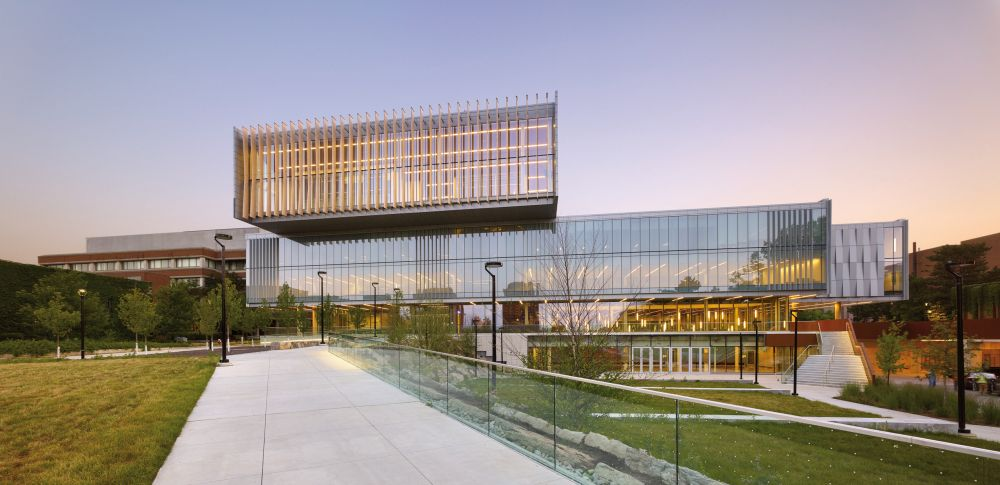
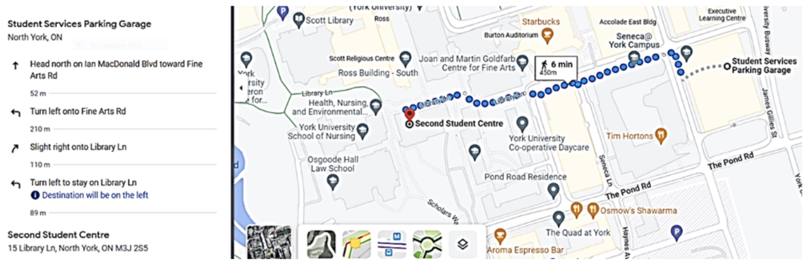

The conference venue is the <a href="https://youtu.be/enMcHisqOnc?si=ConM0H4mmWAy2gfH">Second Student Centre (SCC)</a> on the <a href="https://maps.app.goo.gl/kYmUzwPSLyVfnvio9"> Keele Campus of York University</a> located at 15 Library Lane, M3J-1P3, Toronto, Canada. 

CASCON attendees are expected to behave in accordance with the <a href="https://www.ieee.org/about/corporate/governance/p7-8.html">IEEE Code of Ethics</a>.

<h1>Registration</h1>

<a href="https://cscan-infocan.ca/co-located-tickets/" target="_blank">Registration Site for CASCON 2024</a>

<ul>
  <li>You may register for one day, two days, or a Full Pass for the whole conference.</li>
  <li>On the day that you are registered, you may attend any of the co-located events.</li>
  <li>Authors of CASCON 2024 papers must register for a Full Pass</li>
  <li>People who require a visa letter must register for a Full Pass</li>
</ul>

<!--
<h2>Registration on or before October 1st, 2024</h2>
<table>
<tr>
<td>Student - One Day (No Banquet)</td><td>$125</td>
</tr>
<td>Student - Two Days (No Banquet)</td><td>$250</td>
</tr>
<td>Student - Three Days (No Banquet)</td><td>$375</td>
</tr>
<td>Student - Full Pass (Includes Banquet)</td><td>$455</td>
</tr>
<tr>
<td>Non-Student - One Day (No Banquet)</td><td>$200</td>
</tr>
<td>Non-Student - Two Days (No Banquet)</td><td>$400</td>
</tr>
<td>Non-Student - Three Days (No Banquet)</td><td>$600</td>
</tr>
<td>Non-Student - Full Pass (Includes Banquet)</td><td>$680</td>
</tr>
</table>
-->

<h2>Registration after October 1st, 2024</h2>

<table>
<tr>
<td>Student - One Day (No Banquet)</td><td>$150</td>
</tr>
<td>Student - Two Days (No Banquet)</td><td>$300</td>
</tr>
<td>Student - Three Days (No Banquet)</td><td>$450</td>
</tr>
<td>Student - Full Pass (Includes Banquet)</td><td>$530</td>
</tr>
<tr>
<td>Non-Student - One Day (No Banquet)</td><td>$250</td>
</tr>
<td>Non-Student - Two Days (No Banquet)</td><td>$500</td>
</tr>
<td>Non-Student - Three Days (No Banquet)</td><td>$750</td>
</tr>
<td>Non-Student - Full Pass (Includes Banquet)</td><td>$830</td>
</tr>
</table>

<h2>Accommodations, Public Transit, Parking:</h2>

There are several hotels in the area of York University and in other areas with easy transit connection to the venue.

<b>There are major events that are likely to attract many out-of-town visitors immediately after the conference days (November 14-16) that may affect price/availability of lodging options. Thus we recommend that you make lodging arrangements in advance.</b>

There is also a <a href="https://www.ttc.ca/subway-stations/york-university">subway station</a> and a <a href="https://www.yrt.ca/en/index.aspx">bus hub</a> within walking distance from the venue. 

<h2>Parking</h2>

CASCON 2024 will take place on the 2 nd  Floor of our Second Student Centre, <a href="https://maps.app.goo.gl/ZXo8B3okcyqGqZg8A">at 15 Library
Lane (North York)</a> on the York University Keele Campus (4700 Keele Street).

 Directions by Car: 
  
Please park on any level of the Student Services Parking Garage. Use a location app (e.g., Google
Maps/Waze) to direct you to the 15 James Gillies Street</a>

To pay for parking, download HonkMobile app to pay for parking (instructions attached).  This parking garage
is Zone # 7728

Below are walking directions from Student Services Garage to Second Student Centre.  Once you are at
Second Student Centre, take the elevator to the 2 nd  floor.

 </a> 

<h2>Accommodations on campus at York University:</h2>

<a href="https://www.acc-schulichexecutiveconferencecentre.com/">Executive Learning Centre at the Schulich School of Business</a> 
Location: 56 Fine Arts Road, North York, Ontario M3J 1P3 
Paid Parking: Bookable through the HONK app 
Nearest Subway Station: York University 
  
Booking: 
Contact the ELC Front Desk at phone: 416-650-8300 
Email: reservations@schulich.yorku.ca 
You will need to provide a credit card at time of booking. 
