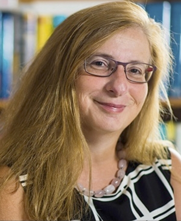

  

    

      

        
      

      

        <h3><b>Eleni Stroulia</b>, University of Alberta</h3>
        <h2>Machine Learning (and Software Engineering) for Cognitive and Mental-Health Indicator Extraction</h2>
        
Psychiatric disorders, such as depression, anxiety, and stress, and neurodegenerative diseases, like Alzheimer's Dementia and mild cognitive impairment plague more than one in every eight people in the world today. These conditions impact the individual's language, making their vocal expressions different from those of healthy individuals. This is the key intuition driving research on "Machine Learning from Speech". Our group has been studying this problem, leveraging a variety of datasets spanning psychiatric disorders and neurodegenerative diseases, aiming to decode the intricate nuances embedded within vocal tones. Our methodology incorporates sophisticated audio analysis techniques with traditional and neural network architectures, all implemented in a modular, configurable, repeatable software pipeline. In this presentation, I report on some key outputs of this work and I reflect on the role that software engineering can play in advancing the quality of this line of research.

        
Dr. <b>Eleni Stroulia</b> is a Professor in the Department of Computing Science, at the University of Alberta. From 2011-2016, she held the NSERC/AITF Industrial Research Chair on Service Systems Management, with IBM. Her research focuses on real-world problems and interdisciplinary challenges, using AI and machine-learning methods. She has played leadership roles in the GRAND, AGE-WELL and CFN Networks of Centres of Excellence. In 2018 she received a McCalla professorship, and in 2019 she was recognized with a Killam Award for Excellence in Mentoring. She has supervised more than 60 graduate students and PDFs, who have gone forward to stellar academic and industrial careers. From 2020 to 2023, she was the Director of the University of Alberta's AI4Society Signature Area, and since 2021 she has been serving as the Vice Dean of the Faculty of Science.

      

    

  

  

    

      

        
      

      

        <h3><b>Bob Blainey</b>, RBC Fellow</h3>
        <h2>Software Delivery Excellence at the Royal Bank of Canada (RBC) – Moving Fast and Not Breaking Things</h2>
        
RBC is Canada’s biggest bank and one of the largest in the world based on market capitalization with over 100,000 employees serving more than 18 million clients in Canada, the United States and 27 other countries. Any organization of this complexity invests deeply in software to automate operations, support staff, and engage their clients. This is no different at RBC, but we also have a special responsibility to win and retain the trust of our clients as we operate across multiple lines of business in many jurisdictions globally which must comply with numerous regulations. This talk will discuss how RBC’s software delivery process has evolved to ensure new products and innovations are delivered quickly to clients while maintaining the highest standard of safety and security. Featured discussions will include how to resolve the tension between control and innovation, the imperative to build secure systems, and the impact we’re seeing of AI on our architecture and software delivery process.

        
<b>Bob Blainey</b> is one of three RBC Fellows and is responsible for driving strategic value creation from Data and AI across RBC. Formerly, Bob was the Chief Architect for Personal &amp; Commercial Banking and led the technical strategy for APIs and open banking. Bob is passionate about building great engineering teams and leveraging the very best technology to deliver unique and engaging customer experiences.

        
Before joining RBC in 2017, Bob worked at IBM for over 25 years holding progressive leadership roles in Engineering and Architecture. In 2011, Bob was appointed an IBM Fellow, which is IBM’s most prestigious technical honour.

        
Bob holds a Computer Science degree from University of Toronto and a Master of Business Administration from Athabasca University, focused on the creation of open source software ecosystems and related business strategy.

        
Outside of spending time with his family, Bob is a fan of and at times borderline obsessive about baseball and is passionate about STEM and particularly engineering &amp; coding education for K-12.

      

    

  

