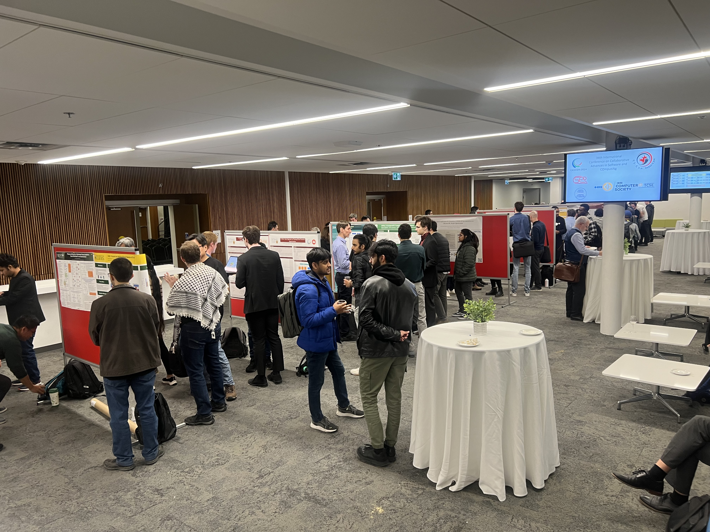
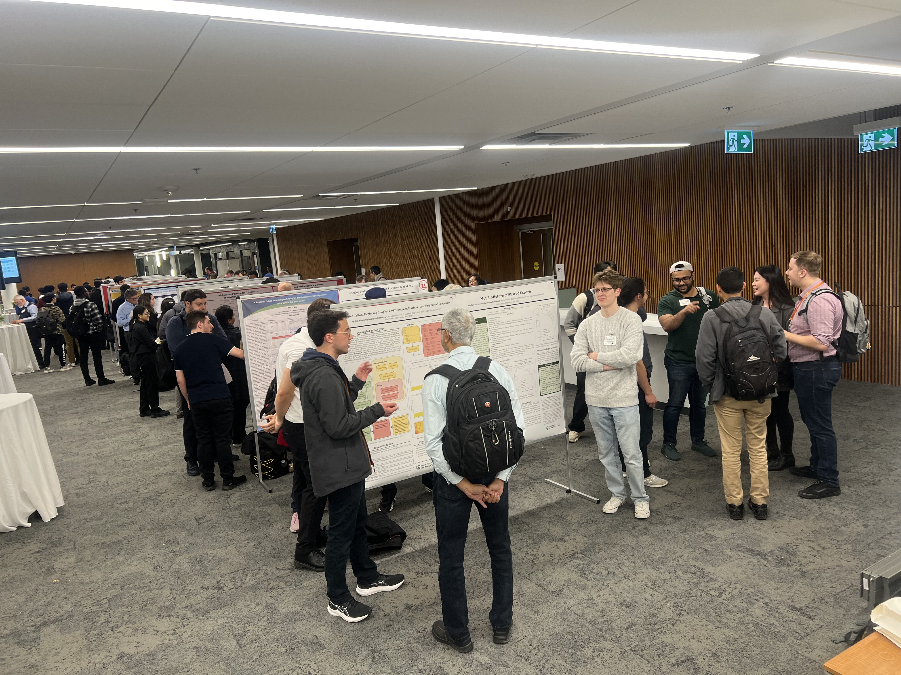
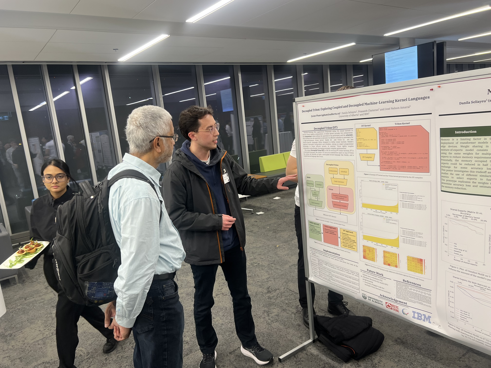
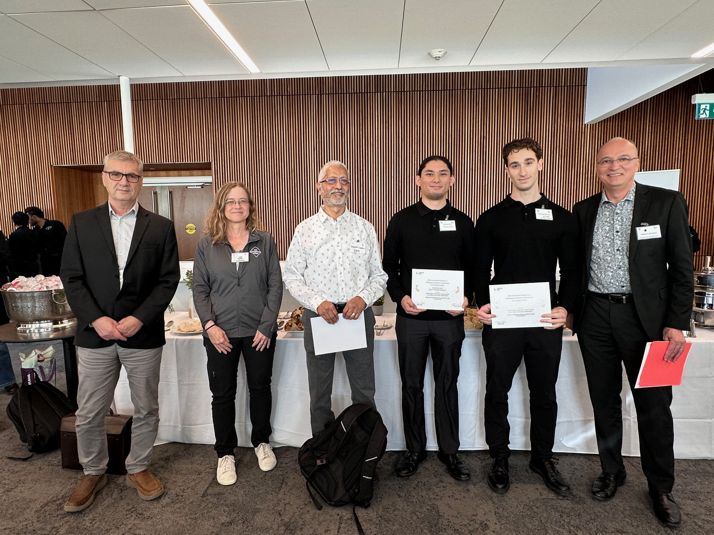
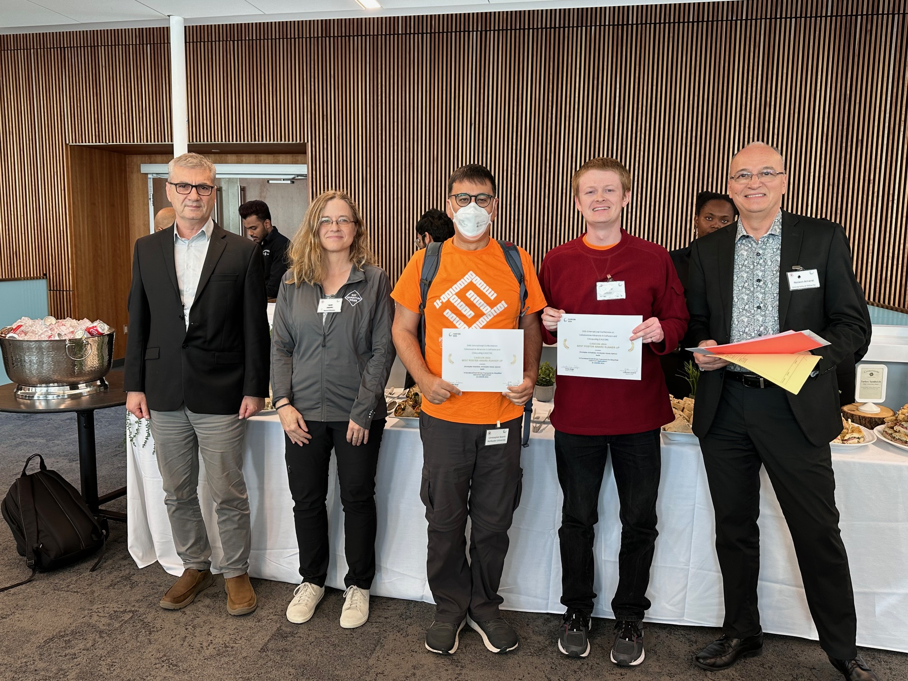
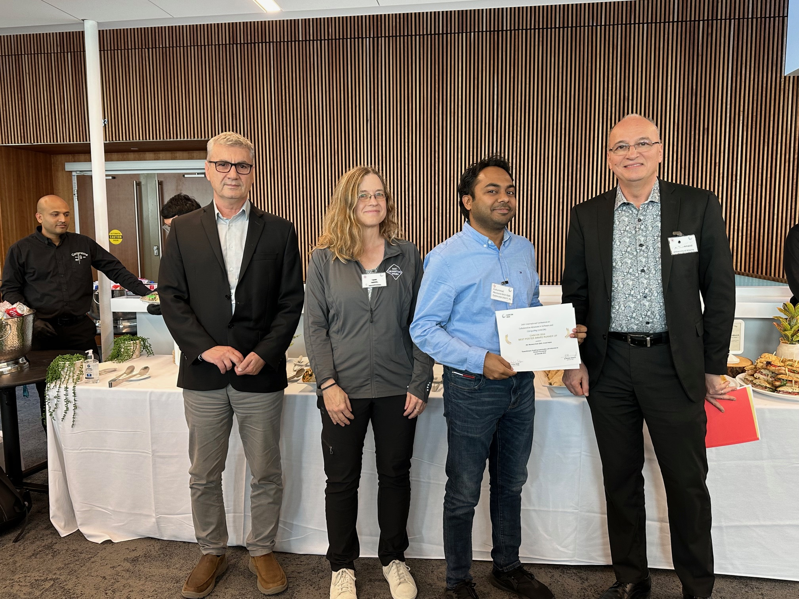

{}

<table>
<tr>
<td></td>
<td></td>
<td></td>
</tr>
</table>

<strong>The Poster presentation and reception will be on Tuesday, November 12, starting at 5:30 PM</strong> 
The maximum area available for each poster is 3 feet wide and 4 feet tall. 
The following posters have been accepted for presentation at CASCON 2024.

Results of the <b>CASCON 2024 Best Poster Competition</b>:
	<ul>
	<li> <b>Best Poster:</b> 
		<ul>
		<li><b>Db2une: Tuning Under Pressure via Deep Learning</b> Alexander Bianchi, Andrew Chai, Vincent Corvinelli, Parke Godfrey, Jarek Szlichta and Calisto Zuzarte</li>
		</ul>
	<li>Runner Ups:</b>
		<ul>
		<li><b>A Functional Event-Driven Framework for Simplified Concurrent Applications</b> Christopher Schankula, Christopher Anand and Spencer Smith</li>
		<li><b>GreenStream: Enabling Sustainable LLM Inference in Stream Processing</b> Md. Monzurul Amin Ifath and Israat Haque</li>
		</ul>
	</li>
	

	</ul>

<table>
<tr>
<td></td>
<td></td>
<td></td>
</tr>
</table>

 The following posters have been accepted for presentation at CASCON 2024:
<ul>
<li><b>2JITsu: A Comparative Analysis of JAX and Pytorch across Modern Machine Learning Workloads</b> Ayrton Chilibeck, Danila Seliayeu, Jose Nelson Amaral and Andy Patterson</li>
<li><b>A blockchain based hybrid access control for industrial internet of things using blockchain</b> Muhammad Shahzad Sarfraz and Muhammad Usman</li>
<li><b>A Functional Event-Driven Framework for Simplified Concurrent Applications</b> Christopher Schankula, Christopher Anand and Spencer Smith</li>
<li><b>A Multi-Table Approach to Floating-Point Function Approximation</b> Lucas Dutton, Christopher K. Anand, Robert Enenkel and Silvia Melitta Müller</li>
<li><b>A multi-tier federated learning approach to pre-impact fall detection using wearable devices</b> Seyed Alireza Rahimi Azghadi, Hung Truong Thanh Nguyen, René Richard, Hélène Fournier, Francis Palma and Hung Cao</li>
<li><b>A Study on future emerging technologies and trend detection algorithms using patent big data and AI</b> Minki Kim</li>
<li><b>Addressing Noise in Multiple Instance Learning</b> Ahmed Al Dallal, James Miller and Shaikh Quader</li>
<li><b>AI Assistants for Incident Lifecycle in a Microservice Environment: An Empirical Review</b> Dahlia Ziqi Zhou and Marios Fokaefs</li>
<li><b>AI-Assisted Pipeline for Cytometry of Reaction Rate Constant</b> Shai Ginsburg, Patil Korkeen, Jessica Latimer, Vasilij Koshkin, Vadim Elisseev and Sergey Krylov</li>
<li><b>An Energy-Efficient Long-Range IoT-Based Water Monitoring System: Challenges and Use Cases</b> Seyed Alireza Rahimi Azghadi, Kamyab Aghajamali, Francis Palma and Hung Cao</li>
<li><b>An Improved MicroJIT for Templated Compilation in OpenJ9</b> Harpreet Kaur, Scott Young, Kenneth Kent and Marius Pirvu</li>
<li><b>Automated Configuration Parameter Tuning in Distributed Messaging Systems</b> Emmanuel Etti, Md. Monzurul Amin Ifath and Israat Haque</li>
<li><b>Automated Detection of Anomalous Patterns in Time Series Logs Using Silhouette Scores</b> Wejdene Haouari and Marios Fokaefs</li>
<li><b>Bringing Profile Guided Binary Layout Optimization to the IBM AIX Platform</b> Dhanrajbir Singh Hira and J. Nelson Amaral</li>
<li><b>Cloud-Boosted JIT: Towards Enhancing Compilation Decision-Making in Containerized Environments</b> Ryan Liu, Shreya Shinde, Abhith Krishna, Ladan Tahvildari, Mark Stoodley, Vijay Sundaresan and Marius Pirvu</li>
<li><b>Db2une: Tuning Under Pressure via Deep Learning</b> Alexander Bianchi, Andrew Chai, Vincent Corvinelli, Parke Godfrey, Jarek Szlichta and Calisto Zuzarte</li>
<li><b>DMBench: Load Testing and Benchmarking Tool for Data Migration</b> Fares Hamouda, Marios Fokaefs and Dariusz Jania</li>
<li><b>DMML: A Machine-learning Performance Model for Data Migration</b> Hasti Ghaneshirazi, Marios Fokaefs, Fares Hamouda, Wejdene Haouari and Dariusz Jania</li>
<li><b>Edge-based Application for On-device COVID-19 Test interpretation</b> Shreya Vaghani and Marios Fokaeks</li>
<li><b>Enhancing Epidemiological Analysis through Data Provenance</b> Sarina Hamedani and Michalis Famelis</li>
<li><b>Evaluating retrieval-augmented generation (RAG) results</b> Sarah Packowski, Jenifer Schlotfeldt and Inge Halilovic</li>
<li><b>Exploring Workforce Needs in Korea's Secondary Battery Industry: Insights and Implications for Talent Development</b> Junwoo Yu</li>
<li><b>FADE: Focused and Attention-Based Detector of Errors</b> Omar Al-Shamali, James Miller and Shaikh Quader</li>
<li><b>GreenStream: Enabling Sustainable LLM Inference in Stream Processing</b> Md. Monzurul Amin Ifath and Israat Haque</li>
<li><b>Identifying and Classifying the Centre of Interests of Non-Verbal Autistic Children in Cartoon Videos</b> Roya Moeini and Sylvie Ratté</li>
<li><b>Inspiring AI-Infused Innovations in Adoptium AQAvit and Openj9</b> Gias Uddin, Afif Mamun, Longyu Zhang and Lan Xia</li>
<li><b>Mixture of Shared Experts</b> Danila Seliayeu, Quinn Pham, Prasanth Chatarasi and Jos&eacute; Nelson Amaral</li>
<li><b>Modelling Performance and Energy Efficiency of AI and HPC Workloads in Heterogeneous Environments</b> Vadim Elisseev, Edward Taylor, Mark Birmingham and James Sexton</li>
<li><b>Online Classification with Reordering  Data Migration Framework</b> Zhongxin Hu, Kaiyu Li, Xingjian Mao, Jingfeng Pan, Yunfei Peng, Aijun An, Xiaohui Yu and Dariusz Jania</li>
<li><b>On-premise z/OS to IBM Cloud: A reference architecture</b> Sanjay Ghanathey</li>
<li><b>OOPredictor: Predicting Object-Oriented Accesses using Static Analysis</b> Hassan Arafat, David Bremner, Kenneth Kent and Julian Wang</li>
<li><b>Optimizing knowledge base content for retrieval-augmented generation (RAG)</b> Inge Halilovic, Sarah Packowski and Jenifer Schlotfeldt</li>
<li><b>Performance Assessment of AI Inference in Edge Devices</b> Ghazal Sobhani, Tushar Sharma and Israat Haque</li>
<li><b>Privacy and Security in Distributed Graph Analytics</b> Bin Guo and Emil Sekerinski</li>
<li><b>Proximity-DRL: A GPU Job Allocator Using Deep Reinforcement Learning</b> Junjie Deng, Aijun An, Hajer Ayadi, Yiming Shao, Hossein Pourmodheji, Hao Zhou and Michael Feiman</li>
<li><b>Rapid prototyping of natural language interfaces</b> Sarah Packowski, Ashley Zhao, Kelly Xiang and Sara Elsharawy</li>
<li><b>RISC-V Analyzer: verify assembly code compliance to register and procedure calling conventions.</b> Rajan Maghera, Nathan Ulmer and J. Nelson Amaral</li>
<li><b>Syntactic and Semantic Analysis of APIs to Assess and Compare their Linguistic Design Quality</b> Krishno Dey, Hung Cao and Francis Palma</li>
<li><b>Towards Energy-Efficient CUDA Kernels: A Predictive</b> Saurabhsingh Rajput, Alexander Brandt and Tushar Sharma</li>
<li><b>Towards Rapid Design of Compartmental Models Modeling Approach</b> Zahra Fiyouzisabah, Jessie Galasso, Marios-Eleftherios Fokaefs and Michalis Famelis</li>
<li><b>Triton vs. Halide: Exploring Coupled and Decoupled Machine-Learning Kernel Languages</b> Quinn Pham, Danila Seliayeu, Prasanth Chatarasi and Jos&eacute; Nelson Amaral</li>
</ul>

 
{}
