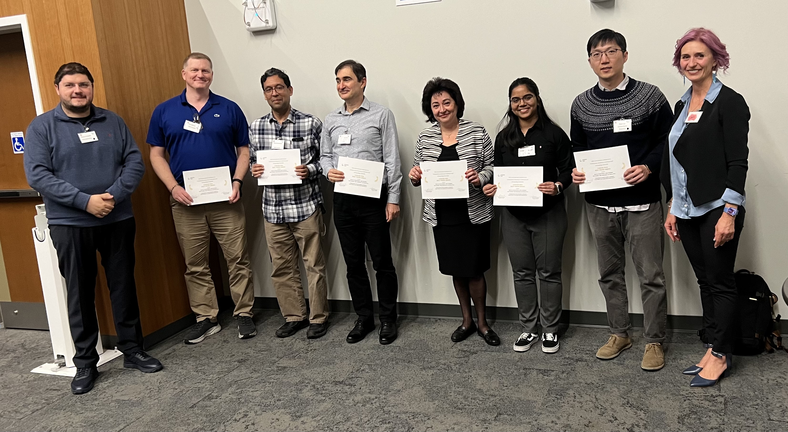
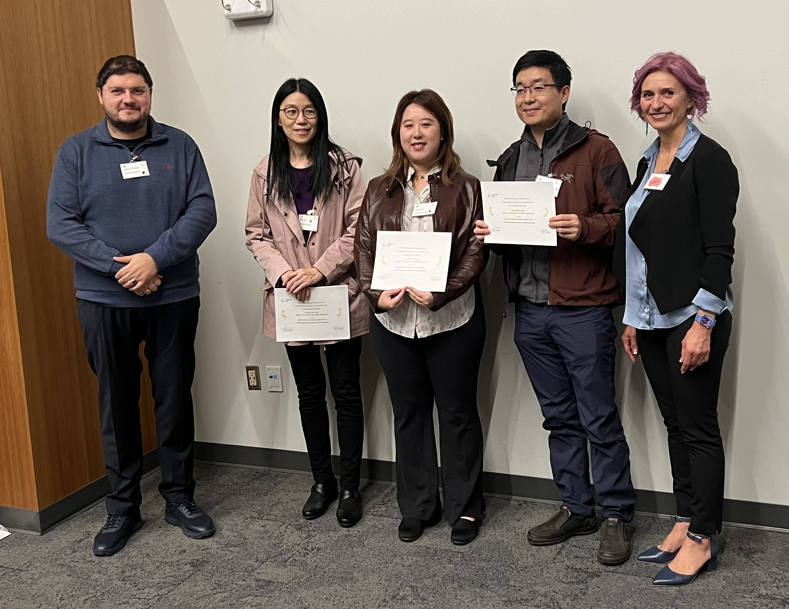
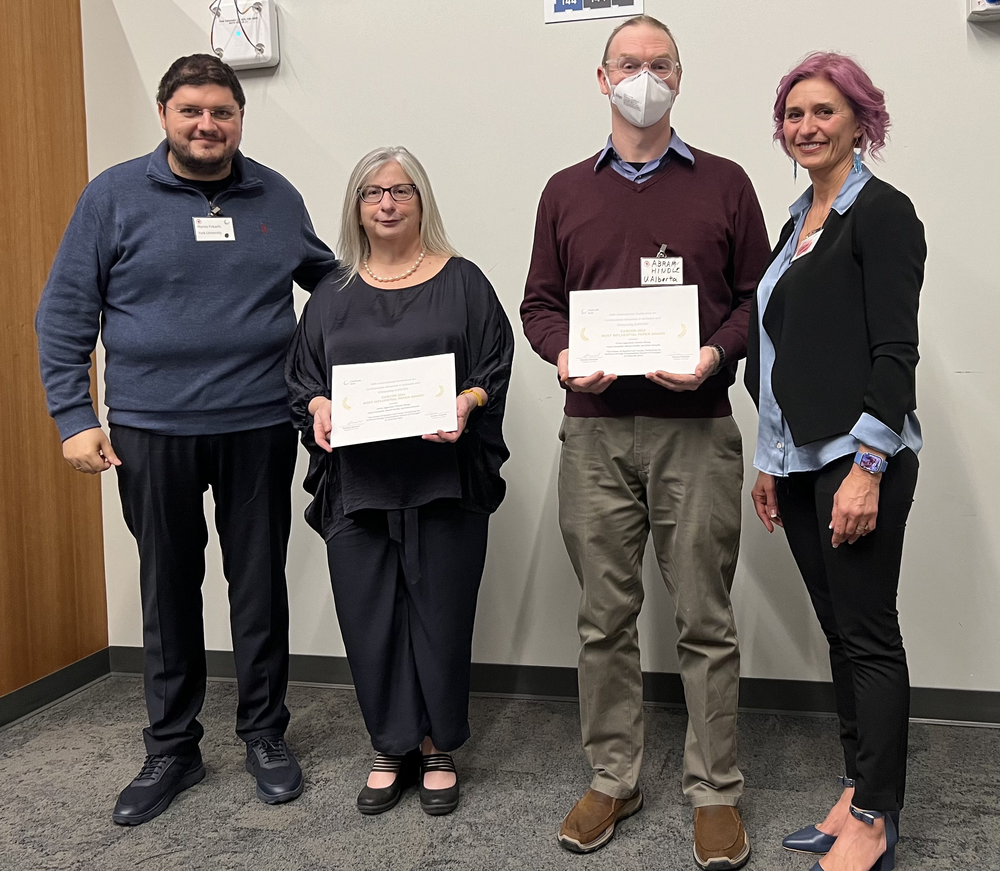
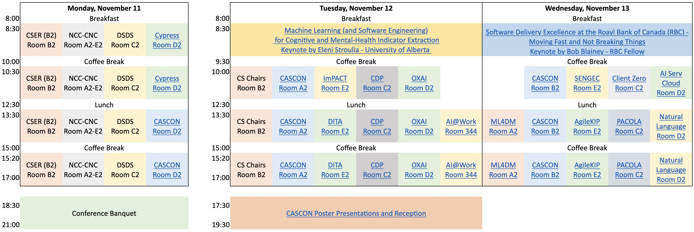

 <link href="CASCONProgramTable.htm" rel="import" />
 
### Quick Links
- [Full Program Schedule](#full-program-schedule)
- [Monday, November 11 2024](#monday-november-11-2024)
- [Tuesday, November 12 2024](#tuesday-november-12-2024)
- [Wednesday, November 13 2024](#wednesday-november-13-2024)

  
  
  

  

## Full Program Schedule

  

During the conference, the papers can be accessed at <a href="">this revised link

<a href="https://uottawa-my.sharepoint.com/personal/pshirani_uottawa_ca/_layouts/15/onedrive.aspx?id=%2Fpersonal%2Fpshirani%5Fuottawa%5Fca%2FDocuments%2FCASCON%202024%20Proceedings&ga=1">in this link</a>.

  <table class="program-schedule-table">
    <thead>
      <tr><th>Day</th><th>Time</th><th>Room</th><th>Capacity</th><th>Location</th><th>Event</th></tr>
    </thead>
    <tbody>
      <tr><td>Monday</td><td>All day</td><td>B2</td><td>130</td><td>2nd floor</td><td><a href="https://www.cser.ca/2024f/">CSER</a></td></tr>
      <tr><td></td><td>All day</td><td>A2-E2</td><td>50</td><td>2nd floor</td><td><a href="https://ncc-cnc.ca/">NCC-CNC</a></td></tr>
      <tr><td></td><td>All day</td><td>C2</td><td>50</td><td>2nd floor</td><td><a href="https://sites.google.com/view/dsds-24">DSDS</a></td></tr>
      <tr><td></td><td>AM</td><td>D2</td><td>50</td><td>2nd floor</td><td><a href="https://sites.google.com/view/cypress2024/">Cypress</a></td></tr>
      <tr><td></td><td>AM</td><td>301</td><td>10</td><td>3rd floor</td><td><a href="https://ncc-cnc.ca/">NCC-CNC</a></td></td></tr>
      <tr><td></td><td>PM</td><td>D2</td><td>50</td><td>2nd floor</td><td><a href="https://cascon.ca/program/#CASCON1">CASCON</a></td></tr>
      <tr><td>Tuesday</td><td>AM</td><td>B2</td><td>130</td><td>2nd floor</td><td><a href="https://cscan-infocan.ca/department-chairs-meeting/">CS-Can Chairs meeting</a></td></tr>
      <tr><td></td><td>AM</td><td>Virtual</td><td>n/a</td><td>Zoom</td><td><a href="https://sites.google.com/view/ytech2024">YTech</a></td></tr>
<      <tr><td></td><td>All day</td><td>A2</td><td>50</td><td>2nd floor</td><td><a href="https://cascon.ca/program/#CASCON3">CASCON</a></td></td></tr>
      <tr><td></td><td>AM</td><td>E2</td><td>50</td><td>2nd floor</td><td><a href="https://cascon.ca/workshops/#iM-PACT">iM-PACT</a></td></tr>
      <tr><td></td><td>All day</td><td>C2</td><td>50</td><td>2nd floor</td><td><a href="https://cdp-workshop.github.io/CDP/">CDP</a></td></tr>
      <tr><td></td><td>AM</td><td>D2</td><td>50</td><td>2nd floor</td><td><a href="https://users.encs.concordia.ca/~abdelw/oxai2024/">OXAI</a></td></tr>
      <tr><td></td><td>PM</td><td>E2</td><td>50</td><td>2nd floor</td><td><a href="https://cascon.ca/workshops/#DITA">DITA</a></td></tr>
      <tr><td></td><td>PM</td><td>D2</td><td>55</td><td>2nd floor</td><td>AI@Work</td></tr>
      <tr><td>Wednesday</td><td>PM</td><td>B2</td><td>130</td><td>2nd floor</td><td><a href="https://cascon.ca/workshops/#ML4DM">ML4DM</a></td></tr>
      <tr><td></td><td>AM</td><td>A2</td><td>50</td><td>2nd floor</td><td><a href="https://cascon.ca/program/#CASCON6">CASCON</a></td></tr>
      <tr><td></td><td>AM</td><td>E2</td><td>50</td><td>2nd floor</td><td><a href="https://yorku-ease.github.io/SENGEC/index.html">SENGE</a>C</td></tr>
      <tr><td></td><td>AM</td><td>344</td><td>55</td><td>3rd floor</td><td><a href="https://github.com/ZeruiW/CASCON24_Tutorial-Workshop_XAI/blob/main/Develop%20Explainable%20AI%20Services%20on%20Cloud%20Computing%20and%20Open%20Source%20Models.md"AI Service on Cloud</a></td></tr>
      <tr><td></td><td>PM</td><td>E2</td><td>50</td><td>2nd floor</td><td><a href="https://cascon.ca/workshops/#AgileKip">AgileKip</a></td></tr>
      <tr><td></td><td>PM</td><td>C2</td><td>50</td><td>2nd floor</td><td><a href="https://cascon.ca/workshops/#ClientZero">Client Zero</a></td></tr>
      <tr><td></td><td>PM</td><td>C2</td><td>50</td><td>2nd floor</td><td><a href="https://cascon.ca/workshops/#PACOLA">PACOLA</a></td></tr>
      <tr><td></td><td>PM</td><td>344</td><td>55</td><td>3rd floor</td><td><a href="https://cascon.ca/workshops/#NatLang">Natural Language</a></td></tr>
    </tbody>
  </table>

<button onclick="printSchedule()" class="print-button" style="background-color: #007bff; color: white; padding: 10px 20px; border: none; border-radius: 20px; cursor: pointer; font-size: 16px; font-weight: bold; margin: 10px 0; display: block; text-align: center; text-decoration: none; transition: background-color 0.2s; box-shadow: 0 4px 8px rgba(0, 0, 0, 0.2); margin: auto;"><i class="fa fa-print" style="margin-right: 8px;"></i> Print Program Schedule</button>

## Monday, November 11 2024

<table>
  <thead>
    <tr>
      <th>Time</th>
      <th>Title / Presenter(s) / Affiliation(s)</th>
    </tr>
  </thead>
  <tbody>
    <tr>
      <td colspan="2"><strong>Session 1</strong> (Chair: J. Nelson Amaral - University of Alberta)</td><a name="CASCON1">
    </tr>
    <tr>
      <td>01:30</td>
      <td>
        <strong>Integrating Feature Selection in Counterfactual Generation: An Optimized Framework Using Simulated Annealing</strong> 
        Shou Nakano1, Yang Liu1 
        1Wilfrid Laurier University
      </td>
    </tr>
	<tr>
      <td>01:55</td>
      <td>
        <strong>Machine Learning-based Control of Dual-Sourcing Inventory Systems</strong> 
        Davood Pirayesh Neghab1, Shijie Li1, Mucahit Cevik1, M. I. M. Wahab1 
        1Toronto Metropolitan University
      </td>
    </tr>
    <tr>
      <td>02:20</td>
      <td>
        <strong>Exploring Large Language Models for Automated Essay Grading in Finance Domain</strong> 
        Garima Malik1, Mucahit Cevik1, Sojin Lee2 
        1Toronto Metropolitan University, 2Blees Technologies Inc. (Blees AI)
      </td>
    </tr>
    <tr>
      <td>02:45</td>
      <td>
        <strong>Overcoming COPD Care Barriers in Northern Ontario with AI -- A Perspective</strong> 
        Aveen Ghahremani1, Nikita Neveditsin2, Adiva Siddiqui1, Vijay Mago1 
        1York University, 2Saint Mary's University
      </td>
    </tr>
    <tr>
      <td>03:00</td>
      <td colspan="2">Coffee Break</td>
    </tr>
    <tr>
      <td colspan="2"><strong>Session 2</strong> (Chair: Weichao Wang - UNC Charlotte)</td><a name="CASCON2">
    </tr>
    <tr>
      <td>03:20</td>
      <td>
        <strong>Detection of Novel Cyberattacks using Multi-Binary Classifiers</strong> 
        Jean-Gabriel Gaudreault1, Paula Branco1 
        1University of Ottawa
      </td>
    </tr>
    <tr>
      <td>03:45</td>
      <td>
        <strong>Smart Contract Families in Solidity</strong> 
        Julio Aguilar1, Kacper Bak1, Michael Boyle1, Valerian Callens1, Jan Gorzny2 
        1Quantstamp, 2Zircuit
      </td>
    </tr>
    <tr>
      <td>04:00</td>
      <td>
        <strong>Equation Unsolved: Inside the Shadowy World of Elite Cyber Spies</strong> 
        Fatemeh Khoda Parast1 
        1University of Guelph
      </td>
    </tr>
    <tr>
      <td>04:15</td>
      <td>
        <strong>Optimizing DDoS Detection with Time Series Transformers</strong> 
        Chibuike Ejikeme1, Nafisek Kahani1, Samuel Ajila1 
        1Carleton University
      </td>
    </tr>
  <tr>
      <td>04:30</td>
      <td>
        <strong>Abstract Interpretation for PLONKish Circuits</strong> 
        Fatemeh Heidari Soureshjani1, Jan Gorzny2 
        1Polytechnique Montreal, 2Zircuit
      </td>
    </tr>
  <tr>
  <td>06:30</td>
  <td> <strong>Conference Banquet</strong> </td>
  </tr>
</tbody>
</table>

## Tuesday, November 12 2024

<table>
  <thead>
    <tr>
      <th>Time</th>
      <th>Title / Presenter(s) / Affiliation(s)</th>
    </tr>
  </thead>
  <tbody>
  <tr>
      <td colspan="2"><strong>Keynote 1</strong> (Chair: Marios Fokaefs - York University)</td>
    </tr>
  <tr>
     <td>8:30</td>
    <td>
    <a href=https://cascon.ca/keynotes/#EleniStroulia><strong>Machine Learning (and Software Engineering) for Cognitive and Mental-Health Indicator Extraction</strong> </a>
    Eleni Stroulia, University of Alberta
    </td>
  </tr>
    <tr>
      <td>9:30</td>
      <td colspan="2">Coffee Break</td>
    </tr>
    <tr>
      <td colspan="2"><strong>Opening Session</strong> (Chair: Marin Litoiu - York University) <a name="CASCON3"></td>
    </tr>
	<tr>
	  <td>10:00</td>
	  <td> <b> CASCON 2024 Opening Session </b> 
	       <b> Presentation of Best-Paper Award, Best-Student-Paper Award, and Most-Influential-Paper (MIP) Award</b> 
		   MIP Award Talk: <b>The Power of System Call Traces: Predicting the Software Energy Consumption Impact of Changes</b> 
		   Karan Aggarwal<sup1, Chenlei Zhang, Hazel Campbell2, Abram Hindle2, Eleni Stroulia2 
		   1Amazon Inc., 2University of Alberta
	</tr>
	  <tr>
      <td colspan="2"><strong>Session 3</strong> (Chair: Francis Palma - University of New Brunswick) <a name="CASCON3"></td>
    </tr>
	<tr>
      <td>10:55</td>
      <td>
        <strong>Machine Learning Powered Workload Prediction and Task Offloading in Vehicular Networks</strong> 
        Pooja Bhardwaj1, Nitin Auluck1, Akramul Azim2 
        1Indian Institute Of Technology–Ropar (IIT–Ropar), 2Ontario Tech University
      </td>
    </tr>
    <tr>
      <td>11:20</td>
      <td>
        <strong>An Adaptive Indoor Localization Approach Using WiFi RSSI Fingerprinting with SLAM-Enabled Robotic Platform and Deep Neural Networks</strong> 
        Seyed Alireza Rahimi Azghadi1, Atah Nuh Mih1, Asfia Kawnine1, Monica Wachowicz1, Francis Palma1, Hung Cao2 
        1University of New Brunswick, 2RMIT University
      </td>
    </tr>
    <tr>
      <td>11:45</td>
      <td>
        <strong>Towards Enhancing Aviation Safety through Advanced Incident Analysis using Large Language Models</strong> 
        Vaishali Siddeshwar1, Akramul Azim1, Sanaa Alwidian1, Masoud Makrehchi1 
        1Ontario Tech University
      </td>
    </tr>
    <tr>
      <td>12:10</td>
      <td>
        <strong>CampusGo: Augmented Reality Indoor-Outdoor Navigation through a Campus Digital Twin</strong> 
        Mo Adel Abdelghany1, Eleni Stroulia1 
        1University of Alberta
      </td>
    </tr>
    <tr>
      <td>12:30</td>
      <td colspan="2">Lunch</td>
    </tr>
    <tr>
      <td colspan="2"><strong>Session 4</strong> (Chair: Akramul Azim - Ontario Tech University) <a name="CASCON4"></td>
    </tr>
    <tr>
      <td>1:30</td>
      <td>
        <strong>Sentiment Analysis with LLMs: Evaluating QLoRA Fine-tuning, Instruction Strategies, and Prompt Sensitivity</strong> 
        Mustafa Burak Topal1, Aysun Bozanta1, Ayşe Başar2 
        1Boğaziçi University, 2Toronto Metropolitan University
      </td>
    </tr>
    <tr>
      <td>1:55</td>
      <td>
        <strong>TriMod Fusion for Multimodal Named Entity Recognition in Social Media</strong> 
        Mosab Alfaqeeh1 
        1Queen's University
      </td>
    </tr>
    <tr>
      <td>2:20</td>
      <td>
        <strong>Transformer-based Text Highlighting for Medical Terms</strong> 
        Mucahit Cevik1, Ayse Bener1, Lara Ozyegen1 
        1Toronto Metropolitan University
      </td>
    </tr>
    <tr>
      <td>2:45</td>
      <td>
        <strong>On Sarcasm Detection with OpenAI GPT-based Models</strong> 
        Montgomery Gole1, Williams-Paul Nwadiugwu1, Andriy Miranskyy1 
        1Toronto Metropolitan University
      </td>
    </tr>
    <tr>
      <td>03:00</td>
      <td colspan="2">Coffee Break</td>
    </tr>
    <tr>
      <td colspan="2"><strong>Session 5</strong> (Chair: Fatemeh Khoda Parast - Quantstamp) <a name="CASCON5"></td>
    </tr>
    <tr>
      <td>3:20</td>
      <td>
        <strong>Worst Case Execution Time Analysis of Real-Time Robotic Algorithms using Reinforcement Learning</strong> 
        Arvin Samiei1, Nafiseh Kahani1, Mohammadreza Dehghanitafti1, Mojtaba Ahmadi1 
        1Carleton University
      </td>
    </tr>
    <tr>
      <td>03:45</td>
      <td>
        <strong>Prioritize: A Priority-Driven Deep Reinforcement Learning Scheduler for Resource Management</strong> 
        Hajer Ayadi1, Aijun An1, Yiming Shao1, Junjie Deng1, Jimmy Huang1, Michael Feiman2, Hao Zhou2 
        1York University, 2IBM Canada
      </td>
    </tr>
    <tr>
      <td>04:10</td>
      <td>
        <strong>Resource Life-Cycle Aware Noise Detection via Kernel Event Monitoring</strong> 
        Morteza Noferesti1, Ben Grandy1, Naser Ezzati-Jivan1 
        1Brock University
      </td>
    </tr>
    <tr>
      <td>04:35</td>
      <td>
        <strong>MemAdapt: Adaptive Monitoring of Memory Usage through Irregularly Sampled Data</strong> 
        Pranjal Chakraborty1, Majid Babaei2, Leila Tahmooresnejad1, Naser Ezzati-Jivan1 
        1Brock University, 2McGill University
      </td>
    </tr>
	<tr>
      <td colspan="2"><strong>CASCON Invited Talk</strong> (Chair: Marin Litoiu - York University) <a name="CASCON4"></td>
    </tr>
    <tr>
      <td>5:00</td>
	  <td> 
	    <strong><a href="#GenAI">The Impact of GenAI in Cybersecurity</strong></a> 
		Iosif Viorel (Vio) Onut 
		IBM Canada
	  </td>
	</tr>
  <tr>
  <td>05:30</td>
  <td> <strong>Poster Presentations and Reception</strong>
  </td>
  </tr>
  </tbody>
</table>

## Wednesday, November 13 2024

<table>
  <thead>
    <tr>
      <th>Time</th>
      <th>Title / Presenter(s) / Affiliation(s)</th>
    </tr>
  </thead>
  <tbody>
    <tr>
      <td colspan="2"><strong>Keynote 2</strong> (Chair: J. Nelson Amaral - University of Alberta)</td>
    </tr>
    <tr>
     <td>8:30</td>
    <td>
    <a href=https://cascon.ca/keynotes/#BobBlainey><strong>Software Delivery Excellence at the Royal Bank of Canada (RBC) – Moving Fast and Not Breaking Things</strong> </a>
    Bob Blainey, RBC Fellow
    </td>
  </tr>
    <tr>
      <td>9:30</td>
      <td colspan="2">Coffee Break</td>
    </tr>
    <tr>
      <td colspan="2"><strong>Session 6</strong> (Chair: Kelly Lions - University of Toronto) <a name="CASCON6"></td>
    </tr>
    <tr>
      <td>10:00</td>
      <td>
        <strong>Assessing and Comparing the Linguistic Design Quality of APIs of Distributed Systems and Microservices</strong> 
        Krishno Dey1, Hung Cao1, Francis Palma1 
        1University of New Brunswick
      </td>
    </tr>
    <tr>
      <td>10:30</td>
      <td>
        <strong>An Empirical Study on Collaborative Uses of Communication Channels for Software Development and Management</strong> 
        Mariam El Mezouar1, Daniel Alencar Da Costa2, Ying Zou3 
        1Royal Military College of Canada, 2University of Otago, 3Queen's University
      </td>
    </tr>
    <tr>
      <td>10:55</td>
      <td>
        <strong>Understanding Defects in Generated Codes by Language Models</strong> 
        Ali Mohammadi Esfahani1, Nafiseh Kahani1, Samuel A. Ajila1 
        1Carleton University
      </td>
    </tr>
    <tr>
      <td>11:20</td>
      <td>
        <strong>Just-In-Time and Real-Time Bug-Inducing Commit Prediction: A Federated Learning Approach</strong> 
        Md Rayhan Islam1, Banani Roy2, Mohammad Hassan2, Amin Nikanjam2 
        1University of Saskatchewan, 2University of Prince Edward Island
      </td>
    </tr>
    <tr>
      <td>11:45</td>
      <td>
        <strong>Augmenting Automatic Root-Cause Identification with Incident Alerts Using LLM</strong> 
        Zakeya Namrud1, Komal Sarda1, Ian Watts2, Larisa Shwartz3, Prateeti Mohapatra4, Seema Nagar4, Marin Litoiu1 
        1York University, 2IBM Canada, 3IBM US, 4IBM India
      </td>
    </tr>
    <tr>
      <td>12:10</td>
      <td>
        <strong>Anaphora Resolution in Software Requirements Engineering: A Comparison of Generative NLP Pipelines and Encoder-Based Models</strong> 
        Savas Yildirim1, Garima Malik1, Mucahit Cevik1, Ayse Basar1 
        1Toronto Metropolitan University
      </td>
    </tr>
    <tr>
      <td>12:30</td>
      <td colspan="2">Lunch</td>
    </tr>
    <tr>
      <td colspan="2"><strong>Session 7</strong> (Chair:  Christopher Anand - McMaster University) <a name="CASCON7"></td>
    </tr>
    <tr>
      <td>01:30</td>
      <td>
        <strong>Merging Roles and Expertise: Redefining Stakeholder Characterization in Explainable Artificial Intelligence</strong> 
        Camélia Raymond1, Sylvie Ratté1, Marc-Kevin Daoust1 
        1École de Technologie Supérieure
      </td>
    </tr>
    <tr>
      <td>01:55</td>
      <td>
        <strong>FaultLLAMA2: A Fine Tuned Large Language Model for Code Recommendations to Reduce Java Lock Contention</strong> 
        Ashadullah Shawon1, Ramiro Liscano1, Akramul Azim1, Vijay Sundaresan2, Yee-Kang Chang2 
        1Ontario Tech University, 2IBM Toronto Lab
      </td>
    </tr>
    <tr>
      <td>02:20</td>
      <td>
        <strong>Spelling Corrector for Turkish Product Search</strong> 
        Damla Şentürk1, Mustafa Burak Topal1, Sevil Adıgüzel2, Melis Öztürk2, Ayşe Başar3 
        1Boğaziçi University, 2Getir Perakende Lojistik A.Ş, 3Toronto Metropolitan University
      </td>
    </tr>
    <tr>
      <td>02:45</td>
      <td>
        <strong>Translating Formal Specs: Event-B to English</strong> 
        Fatemeh Kazemi Vanhari1 
        1McMaster University
      </td>
    </tr>
    <tr>
      <td>03:00</td>
      <td colspan="2">Coffee Break</td>
    </tr>
    <tr>
      <td colspan="2"><strong>Session 8</strong> (Chair: Kenneth Kent - University of New Brunswick) <a name="CASCON8"></td>
    </tr>
    <tr>
      <td>03:20</td>
      <td>
        <strong>An Improved Template-based JIT Compiler for Java</strong> 
        Harpreet Kaur1, Marius Pirvu1, Kenneth B. Kent2 
        1University of New Brunswick, 2IBM Canada
      </td>
    </tr>
    <tr>
      <td>03:45</td>
      <td>
        <strong>Language-Agnostic Compilation Scheduling Algorithms for Partial AOT Compilations</strong> 
        Georgiy Krylov1, Gerhard Dueck1, Kenneth Kent1, Younes Manton2 
        1University of New Brunswick, 2IBM Canada
      </td>
    </tr>
    <tr>
      <td>04:10</td>
      <td>
        <strong>Using Semeru Cloud Compiler to Enhance Cloud-Native Java Application Performance</strong> 
		<b style="color:#3633FF"> CASCON 2024 Best Paper</b> 		
        Ryan Liu1, Shreya Shinde1, Ladan Tahvildari1, Mark Stoodley2, Vijay Sundaresan2, Marius Pirvu2 
        1University of Waterloo, 2IBM Centre for Advanced Studies
      </td>
    </tr>
    <tr>
      <td>04:35</td>
      <td>
        <strong>Node.js Energy Awareness on Asymmetric Multi-Processing Systems</strong> 
        Hao Hu1, Kenneth Kent2, Joran Siu2, Michael Dawson3 
        1University of New Brunswick, 2IBM Canada, 3Red Hat Canada
      </td>
    </tr>
    <tr>
      <td>05:00</td>
      <td>
        <strong>Power-Efficient, Accelerated, Exponential-Based Activation Functions</strong> 
        Kieran Henderson1, Christopher K. Anand1, Curtis D' Alves2, Robert Enenkel2, Silvia M Mueller3 
        1McMaster University, 2IBM Canada, 3IBM Germany Development
      </td>
    </tr>
    <tr>
      <td>05:25</td>
      <td>
        <strong>Optimizing Data Compression via Data Reordering</strong> 
		<b style="color:#3633FF">CASCON 2024 Best Student Paper</b> 
        Qinxin Du1, Xiaohui Yu1, Aijun An1, Dariusz Jania2 
        1York University, 2IBM Poland
      </td>
    </tr>
  </tbody>
</table>

<a name:GenAI><strong>The Impact of GenAI in Cybersecurity</strong> 
Iosif Viorel (Vio) Onut, IBM Canada 

<b>Abstract</b>: On the one hand, GenAI has great potential in cybersecurity,
learning from patterns in threats and vulnerabilities to enhance
defences and thereby contribute significantly to a robust
cybersecurity posture. A model trained on extensive cybersecurity data
can identify patterns and predict future threats. Cybersecurity
professionals can use GenAI to anticipate and prevent threats,
maximizing the effectiveness of their security tools. Enterprises may
realize a more proactive cybersecurity approach using GenAI. On the
other hand, GenAI technologies themselves present cybersecurity
threats. They can be exploited for malicious purposes, such as
identity impersonation. This misuse can significantly bolster social
engineering attacks, making them more convincing. This CASCON 2024
Spotlight Presentation sheds light on both GenAI technologies being
misused for cyber-attacks and opportunities for enhancing the
cybersecurity posture of enterprise systems using GenAI technologies.
By examining the impact of GenAI-driven social engineering attacks, we
aim to raise awareness of responsible GenAI.

    
<b>Biography</b>: Iosif Viorel (Vio) Onut is Head of Centre for Advanced
Studies, IBM Canada Lab and IBM Master Inventor at IBM Security. He is
Adjunct Professor at the University of Ottawa and co-director of the
University of Ottawa and IBM Cyber Range. He specializes in
cybersecurity and cybercrime research and development. He is also
passionate about curriculum and product innovation acceleration
through R&D. Over the past decade, he has managed over 150 research
projects involving 35 universities, led by over 90 professors, over
360 students and over 330 IBM staff.

