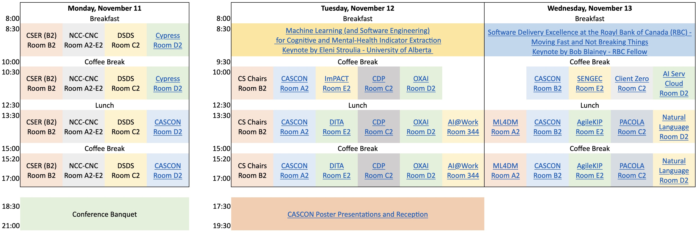

{}
CASCON 2024 will feature the following Workshops and Tutorials:

<b>Schedule</b>

### Monday, November 11, 2024

| Time | Room | Capacity | Event |
|------|------|----------|-------|
| AM   | D2   | 50       | [CyPress: 4th Workshop on Software Techniques for Cyber-Physical Systems](https://sites.google.com/view/cypress2024/) |

 

### Tuesday, November 12, 2024

| Time | Room | Capacity | Event |
|------|------|----------|-------|
| AM   | Virtual   | n/a  | [YTech: CASCON STEM Outreach Workshop](https://sites.google.com/view/ytech2024) |
| AM   | E2   | 50       | [1st Workshop on Intelligent Modeling for Practical Applications and Community Transformation in Life Sciences (iM-PACT)](#iM-PACT) |
| All day | C2   | 50       | [20th Workshop on Compiler-Driven Performance (CDP)](https://cdp-workshop.github.io/CDP/) |
| All Day   | D2   | 50       | [The Workshop of Observability and Explainability of AI Systems (OXAI)](https://users.encs.concordia.ca/~abdelw/oxai2024/) |
| PM   | E2   | 50       | [1st Workshop on Dependable Internet-of-Things Applications (DITA)](#DITA) |
| PM   | 344   | 55       | [AI in the Workplace (AI@Work)](https://github.com/ICCSSE/CASCON2024/blob/main/content/en/workshops/AI%40Work.pdf) |

 

### Wednesday, November 13, 2024

| Time | Room | Capacity | Event |
|------|------|----------|-------|
| AM   | E2   | 50       | [1st Workshop on Software Engineering Economics](https://yorku-ease.github.io/SENGEC/index.html) |
| AM   | D2   | 55       | [Tutorial: Develop Explainable AI Services on Cloud Computing and Open Source Models](https://github.com/ZeruiW/CASCON24_Tutorial-Workshop_XAI/blob/main/Develop%20Explainable%20AI%20Services%20on%20Cloud%20Computing%20and%20Open%20Source%20Models.md) |
| PM   | A2   | 50      | [ML4DM '24: The Fourth Workshop on the Emerging Applications of Machine Learning in Modern Data Management](#ML4DM) |
| PM   | E2   | 50       | [Tutorial: AgileKip PAP - Bridging Business and IT with Open-Source Process Automation](#AgileKip) |
| PM   | C2   | 50       | [What Can You Learn from The Story of IBM's "Client Zero" AI Business Transformation](#ClientZero) |
| PM   | C2   | 50       | [2nd CASCON Workshop on Proactive Continuous Operations using Large Language Models (LLMs) and AIOps: Generative AI as a Catalyst for Innovation (PACOLA)](https://sites.google.com/rigiresearch.com/cascon-aiops-workshop/) |
| PM   | D2   | 55       | [Natural language interfaces powered by large language models](#NatLang) |

 

<h2> Natural language interfaces powered by large language models</h2>

<h3>Abstract:</h3>

Natural language (NL) interfaces have been a topic of research for fifty years. In that time, much has been learned about user experience design for NL interfaces and about how people use language when interacting with NL interfaces. But translating natural language to a deterministic command or structured query that a machine can execute has remained an extremely challenging task. Recently, large language models (LLMs) have made that task much easier. As a result, NL features will become standard for many applications in the coming months and years. We are at the start of a new era of user experience design.

In this hands-on workshop, participants will learn the fundamentals of NL interfaces. Topics will include: the history of NL interfaces, why LLMs now make it easier to implement NL interfaces, which application scenarios are a good fit for NL features, as well as ethics and accessibility considerations. Workshop participants will also gain experience building NL features using an NL interface prototyping web app.

<h2> Tutorial: Develop Explainable AI Services on Cloud Computing and Open Source Models</h2>

<h3>Abstract:</h3>

The objective of this tutorial is to introduce systematic
methods with supplementary tools and computing models for
developing explainable AI. As AI increasingly penetrates various
application domains, practitioners need more comprehensive
approaches for model quality assessments and explainability.
This tutorial bridges the gap between theoretical XAI techniques
and their practical implementation in cloud services and opensource
models. We explore a range of XAI methodologies, from
model-agnostic to model-specific approaches, examining their
applicability across diverse AI models and deployment scenarios.
The tutorial introduces design principles for integrating XAI into
AI services and facilitating early adoption in MLOps lifecycles.
Through experimental evaluations and case studies on both cloud
AI services and open-source models, we demonstrate the effectiveness
of these approaches in real-world scenarios. We discuss
strategies for pipeline automation, provenance data management,
and optimizing the operational overhead of XAI integration.
Additionally, we explore the robustness of XAI methods under
adversarial conditions. This comprehensive exploration equips
participants with insights into XAI’s role in AI systems, practical
implementation skills, and critical perspectives on future research
directions, ultimately benefiting the development of explainable
and robust AI systems.

<h2> 20th Workshop on Compiler-Driven Performance (CDP)</h2>

<h3>Abstract:</h3>

This is the 20th edition of the Workshop on Compiler-Driven Performance (CDP) at
CASCON. This workshop provides a unique opportunity for academic researchers, industry
researchers, and developers from across Canada and the United States to examine the
state-of-the-art compiler technology and discuss future directions for research and
development.

The CDP workshop consists of presentations of reports on research progress at various
academic and industrial sites across Canada and in the United States.
Developments in computing technology motivate a number of key challenges for compilers
to address. Topics to be discussed in the workshop will include, but are not limited to: 
<ul>
<li>innovative compiler analysis, transformation, and optimization techniques</li>
<li>languages, compilers, and optimization techniques for multicore processors and
other parallel architectures</li>
<li>analysis and compilation techniques for dynamic programming languages</li>
<li>compiling for streaming or heterogeneous hardware</li>
<li>dynamic compilation for high-performance and real-time environments</li>
<li>compilation and optimization for scripting languages</li>
<li>compilation techniques for reducing power</li>
<li>program safety</li>
<li>whole system optimization and analysis</li>
<li>tools and infrastructure for compiler research</li>
<li>intermediate representations for code</li>
<li>compiler techniques for hardware accelerators</li>
<li>leveraging AI and LLMs for code generation
</ul>

<h2> The Workshop of Observability and Explainability
of AI Systems</h2>

<h3>Abstract:</h3>

This workshop aims to bring together researchers,
professionals, and academics to discuss and advance the state of
the art and best practices in observability and explainability of AI
systems. An explainable AI system allows users and stakeholders
to understand the automated decision-making process for ensuring
trust, and compliance with regulations and ethical standards.
Observability, which involves the ability to measure, monitor,
and understand the internal states and behaviors of AI systems.
The combination of observability and explainability contributes
to form the data centric base for responsible AI development.
This workshop invites contributions that explore the intersection
of observability and explainability in AI, focusing on methods,
frameworks, and practices that enhance our understanding and
development of AI-driven systems.

<h2> 1st Workshop on Intelligent Modeling for Practical Applications and Community Transformation in Life Sciences (iM-PACT)</h2>

<h3>Abstract:</h3>

Modeling is a vital part of the design thinking of complex systems and in studying and understanding complex phenomena. Its ability to abstract systems, while retaining domain-specific details, allows stakeholders to view the system from different perspectives. Models can serve as the effectively indistinguishable digital counterpart of actual real-world physical products, systems, and processes (sometimes referred to as twins) for practical purposes, such as simulation, integration, testing, monitoring, maintenance, and artifact generation.

In computer science and mathematics, modeling is standard practice across many domains, including but not limited to machine learning models, system models, and performance models. Besides, modeling plays an important role in various domains such as epidemiology, environmental studies, and biology. For example, epidemiological models during the COVID-19 pandemic played a crucial role in understanding the spread of the virus, evaluating the potential impact of interventions, and guiding public health decisions. However, it also became evident that tool support for domains other than computer science is not as developed or as accessible to non-CS experts. Challenges around usability, appropriateness, and representativeness pose obstacles to the adoption of tools traditionally used in software modeling by experts in other.

The objective of this workshop is twofold: first, to expose modeling experts to tooling and automated processes related to modeling, from design to code generation and to simulation, and second, to raise awareness for developers of modeling tools to listen to challenges of other domains and develop appropriate tools.

<h2>CyPress: 4th Workshop on Software Techniques for Cyber-Physical Systems</h2>

<h3>Abstract:</h3>

Cyber-Physical Systems (CPSs) refer to systems comprising of software components, physical components and social entities which monitor, control, and coordinate processes within a physical environment. CPSs apply to a wide range of mission-critical applications that span from the intelligent management of logistics in complex supply chains, advanced manufacturing systems and smart contracts, all the way to autonomous systems, and systems that support the smart interactions between humans and machines (M2H), or between machines (M2M). In this respect, the engineering of CPSs goes beyond existing Software Engineering concepts, tools and techniques because of the very nature of CPSs that spans three realms (cyber, physical, social) and therefore need to address requirements that span these realms.

The workshop aims to bring together leading researchers, as well as experts from software and hardware companies and technology receptors to discuss and debate the latest developments in engineering Cyber-Physical Systems.

<h2> YTech: CASCON STEM Outreach Workshop</a> (virtual Zoom event)</h2>

<h3>Abstract:</h3>

Collectively, we face significant challenges to our well-being and overall future existence as a society — climate change, healthcare, liveable cities, transportation, finance — the list goes on. But there are solutions on the horizon, and this is going to take an “all-hands-on-deck” approach.

According to Statistics Canada, more than 140,000 Canadians graduated with a STEM degree in 2021. Furthermore, a survey by Randstad found that 65% of Canadians between the ages of 45 and 67 would focus on a career in STEM if they were 18 again.

STEM careers include much more than sitting in front of a computer. With science, we can develop materials that make the colour of our cars stay shiny. With math we can optimize the schedules of city buses. With industrial processes we can develop materials that make airplanes lighter so they consume less fuel.

This workshop aims to bring together in one virtual space students, professors, and admission officers so that Grade 9-12 students can get a glimpse of exciting STEM areas and consider these in their possible career paths.

<h2> 1st Workshop on Dependable Internet-of-Things Applications (DITA)</h2>

<h3>Abstract:</h3>

As society and economy progressed through the information age to the age of “intelligent things” and cyber-physical systems, new challenges have risen. As digital systems become more interconnected with people and enter more aspects of daily life, their reliability becomes of paramount as it may not only disrupt economic activity, but also prove a security and safety hazard. Internet-of-Things, which is the umbrella term for all applications of interconnected intelligent digital devices, encompasses a number of technical aspects that span from software engineering and artificial intelligence to hardware-software co-design and data science. In 2018, a group of researchers across Canada put together the DITA NSERC CREATE (Collaborative Research and Training Experience) program. As a CREATE program, DITA aimed to provide unique training opportunities to undergraduate and graduate students on IoT, software engineering, data science and cybersecurity, along with their applications on domains such as health, civil engineering, and urban development. As a primarily industrial program, DITA forged a number of collaborations with local companies, which gave our trainees a chance for more practical experience through internships. Six years later, the 1st DITA workshop at CASCON aims at taking a retrospective look at the achievements of the DITA CREATE program and of its graduates. In addition, it aims at providing an outlook for future research on IoT and cyber-physical systems. Alumni of the program and industrial collaborators will talk about their experience with the program and their views on the future of IoT research.

<h2> AI in the Workplace (AI@Work)</h2>

<h3>Abstract:</h3>

This workshop will address three critical challenges in integrating AI into the workplace.
The format will be three panel sessions with a paper presentation in the set. The first
panel explores the issue of declining productivity in Canada and the potential for AI to
enhance it. The second panel focuses on how AI can support white-collar and service
workers. We will present a paper on the impact of AI-enhanced social media on human
behaviour, with a specific emphasis on adolescents and educators. The session will
conclude with a panel discussion on the necessity of governance and the responsible
use of AI as its presence in the workplace grows. To cultivate a comprehensive
Canadian response, we aim to raise awareness of these issues within the broader
community, encompassing business, academia, and government.

<h2> ML4DM ‘24: The Fourth Workshop on the Emerging Applications of
Machine Learning in Modern Data Management</h2>

<h3>Abstract:</h3>

Machine Learning (ML) has gained prominence across
various fields, including data management. Rule-based
components are being replaced by ML-driven counterparts that
extract rules from experience. Statistical methods are giving way
to approaches that learn functional dependencies, correlations, and
data skewness. Learning-based techniques offer advantages, such
as reducing the cost of developing and maintaining complex
classical modules while tailoring behavior to individual system
needs. This workshop brings together leaders from research
projects and audiences from academia and industry to explore
examples of utilizing ML to modernize data management. The
discussed instances span five categories: Robust Plan Selection,
Database Knobs Tuning, Data Acquisition, Join Order Selection,
and Query Plan Representation.

<h2> 1st Workshop on Software Engineering Economics</h2>

<h3>Abstract:</h3>

With the transition of economy towards the fourth and fifth industrial revolutions, software has acquired an even more important role in the economy. From a business enabler and an economic driver, software has become the actual product. Many traditional sectors, like banking or manufacturing, have transformed from mere software users to software producers and providers. In this sense, software carries increasing economic and business value for various critical businesses and sectors. Unlike traditional products and services, software does not follow the normal product cycle (production-usage-decay) in the same way. Through continuous evolution, software has the ability to be updated and upgraded without necessarily decaying or being replaced. One challenge in looking at the economic aspect of software is the inability to translate its technical properties into business or financial values at the various development phases of the software product. It is not always only about production cost, but also about operational reliability, perceived quality, marketability, profitability, and maintainability of the software. The goal of this workshop is to bring together experts from the different relevant disciplines (economics, business and marketing, and software engineering) and discuss the challenges and strategies of creating sustainable and successful software products. Through invited talks and expert panels, the audience of the workshop will have the opportunity to explore how to transform an idea for a software application to marketable product, what the challenges are around a sustainable and profitable software product and how to model the economics of software from its technical parameters.

<h2> What Can You Learn from The Story of IBM's "Client Zero" AI Business Transformation</h2>

<h3>Abstract:</h3>

After COVID a new pandemic is taking the world by storm – that of Generative Artificial Intelligence, and Chat GPT was the first variant.
Even though AI research and development has been going on for decades, and IBM being one of the leading pioneers in the field, and more traditional AI systems have been in use already, generative AI is now capable of
<ul>
<li> removing repetitive labor,</li>
<li> automating tedious labor (large volumes) and </li>
<li> increase rate of solving complex problems. </li>
</ul>

By automating routine and tedious tasks, it allows users to spend more time on creative and innovative work, and businesses to unleash new potential and create new value.
This session is designed to share the story of IBM’s business transformation – how as “Client Zero” we are using our own Generative AI and Cloud technologies, and those of our partners, to deliver $3 billion in productivity by the end of 2024.

<h2> Tutorial: AgileKip PAP - Bridging Business and IT with Open-Source Process Automation</h2>

<h3>Abstract:</h3>

This half-day tutorial is ideal for software engineers, IT professionals, and business analysts
interested in leveraging open-source tools for Process Automation.
It will introduce participants to the AgileKip Process Automation Platform, an open-source
solution designed to enhance Business Process Management (BPM) and bridge the gap
between business and IT.

The session will begin with a concise overview of Business Process Model and Notation
(BPMN) and Decision Model and Notation (DMN), discussing its significance and extended
usability in modern business environments.

Following this, we will explore the critical role of Business Process Management Systems
(BPMS) in unifying business operations and IT, with a focus on how AgileKip exemplifies
these capabilities.

Attendees will gain hands-on experience with the AgileKip Platform through practical
demonstrations and real-world use cases, showcasing its adaptability and effectiveness in
various business contexts.

<h2> 2nd CASCON Workshop on Proactive Continuous Operations using Large Language Models (LLMs) and AIOps: Generative AI as a Catalyst for Innovation</h2>

<h3>Abstract:</h3>

Increasingly demanding user expectations on modern cloud systems' performance, reliability, and offered value lead to increased complexities and uncertainties in system operations. DevOps teams often face complex operational challenges that exceed human abilities, resulting in inefficient or ineffective issue-resolution actions. Most of these challenges stem from the required orchestration of diverse technologies and the interpretation of vast data streams. Consequently, recent data-driven, automation-oriented, and reasoning-focused technological breakthroughs such as AIOps, Digital Twins (DTs), and Generative AI (GenAI) pose a significant opportunity to enhance risk mitigation, root cause analysis, problem resolution, and operational optimization for cloud systems. The "2nd CASCON Workshop on Proactive Continuous Operations using Large Language Models (LLMs) and AIOps: Generative AI as a Catalyst for Innovation" aims to explore the cutting-edge blend of GenAI, AIOps and DTs in modern IT environments. This workshop provides a dynamic platform for exchanging innovative ideas, recent advancements, and practical insights into these transformative technologies for academic researchers and industry practitioners. The primary workshop goals are: i) to foster discussions on how GenAI can drive further enhancing Proactive AIOps through DTs; ii) to identify research opportunities and challenges and uncover potential case studies; and iii) to set a roadmap for future development and commercialization of AIOps and DT technologies empowered by GenAI. The workshop will feature a combination of keynote presentations, invited talks, and interactive panels designed to highlight the latest research and practical applications. Participants will be able to engage in collaborative activities, analyze relevant case studies, and discuss the real-world impact of these technologies.

 
{}
