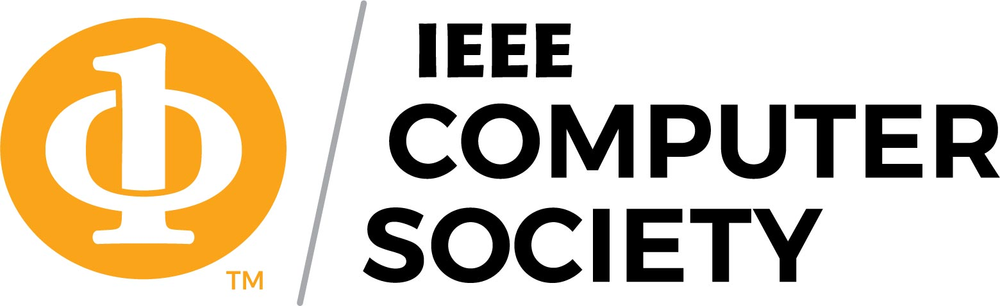
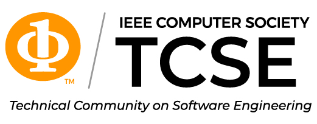


<h1 class="title">35th International Conference on Collaborative Advances in Software and COmputiNg (CASCON)</h1>

 CASCON 2025

Second Student Centre, York University

15 Library Lane, Toronto, Canada

November 10-13, 2025

<!--  -->


{}
<a class="btn btn-lg btn-secondary me-3 mb-4" href="cfp/">
  Call for Papers<i class="fas fa-arrow-alt-circle-right ms-2"></i>
</a>

Important Dates
{.h3 .text-center}

<table class="table caption-top">
  <tbody>
    <tr>
      <td>Poster (title/abstract) submission</td>
      <td>Coming soon!</td>
    </tr>
    <tr>
      <td>Notification of acceptance</td>
      <td>Coming soon!</td>
    </tr>
  </tbody>
</table>

CASCON is a premier academic and industrial conference for advanced studies in computer science and software engineering. Since 1991, CASCON has attracted software developers, researchers, innovators, technologists and decision-makers from academia, industry, and government, who come together to learn about technology trends, present papers, participate in workshops, and exhibit prototypes and solutions.
The conference program features thought-provoking keynotes, original research papers, stimulating workshops, and an engaging technology expo. Conference proceedings are published in the <a href="https://ieeexplore.ieee.org/Xplore/home.jsp">IEEE XPlore</a>.  
We are happy to announce that this year CASCON will be co-located with CSCAN-INFOCAN, aiming to promote knowledge sharing, networking, and innovation in Canadian computer science and related fields.



<!-- {} -->

<!-- {}
Sponsors
{.h1 .text-center}
{} -->

<!-- {}

  

  
  

  
  

  

{} -->

